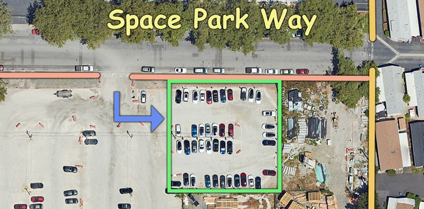

+++
title = 'Space Park Way Renovation'
date = 2024-06-24T12:13:31-07:00
description = "Temporary Closure for Sobrato Construction"
weight = 10
draft = false
slug = "space_park_way_repaving"
aliases = [
  '/space_park_way',
  '/Space_Park_Way',
  '/spaceparkway',
  '/SpaceParkWay',
  '/space-park-way',
  '/Space-Park-Way',
  'space_park_way_closure']

[menus.main]
    parent = 'Development'
    name = "Space Park Way"

+++

This summer, Sobrato will be grinding down Space Park Way and putting down new asphalt after renovating infrastructure underground. The project is scheduled for completion by August 31, 2024.

## No Parking on Space Park Way

Space Park Way will remain open to car traffic, but parking will be severely restricted from July 15 to August 29. Eliminating parking will make it possible to keep two-thirds of the street open so that Santiago Villa residents can continue to enter and exit the park. Street parking will be restored after the project is completed.

**If you park on Space Park Way, you must move your vehicle by Sunday, July 14, or it will be towed**. However, Sobrato has set aside 40 parking spaces in their own lot just for Santiago Villa residents. This temporary lot is close to the mobile home park on the south side of Space Park Way.

To park in this lot, you must display a special parking permit. You can get a permit from the Santiago Villa office, or you can email board@santiagovilla.org. One of your neighbors on the SVNA board will make sure you get your permit.

> NOTE: Sobrato is providing this parkiong lot as a courtesy, just as they did for Google employees who previously parked there. They are not taking responsibility for any construction debris your car picks up in that lot.

On this side of the street, there will be no parking from July 15 to July 20, and from August 23 to August 30. If you don't reside in the park and don't have a permit, you might find a parking spot on the south side of Space Park Way outside of those dates.

## Local Discussion

Join the neighborhood Google Group at SantiagoVilla.org/Subscribe to get updates and participate in conversations about the project. You can use the group to communicate via email with your neighbors and share information about any conditions or problems that may arise.

### Conditions during construction

Space Park will be divided into two unequal lanes between Shoreline and Santiago Villa. A local construction team will direct traffic in both directions and into parking lots on both sides of the street.

- The south lane (closest to construction) will be excavated to enable underground infrastructure reconstruction.
  - Excavation will be about 18 inches deep along the south side, but will not extend as far as the Shashi Hotel.
  - The Space Park reconstruction will include the extension of Inigo into Space Park Way just east of the Shashi Hotel.
  - Although underground pipes have already been replaced and repaired, those closest to the park must be reset to descend about six inches down from the ones in the park, moving the flow of water down towards Shoreline.

- The north lane is expected to be wide enough to manage two lanes of cars, providing entry and exit for mobile home residents and building occupants.
  - It might be necessary to temporarily prevent cars from using the street. Because this would interfere with emergency and RV vehicles, Sobrato will do everything they can to prevent such a disruption.
  - If this does occur, access to Space Park Way will be restored as soon as possible.

## Expected Benefits for Santiago Villa

- The Inigo extension from La Avenida to Pear to Space Park will create additional access to and from the mobile home park.
- The infrastructure renovation is likely to stop the seasonal flooding to the front of the park.