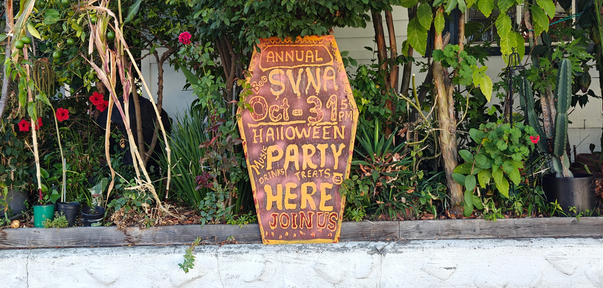

+++
title = '🦇 Halloween 2024 👻'
date = 2024-10-01T01:14:45-07:00
description = "2024's Halloween Event, Incubating Now"
draft = false
layout = "simple"
showBreadcrumbs = true
feature = "*_1*"
summary = "Jooooin Usssss"
weight = 2

aliases = [
    '/halloween',
    '/Halloween',
    '/halloween-event',
    '/Halloween-event',
    '/Halloween-Event',
    '/Halloween-party',
]

[menu.main]
    parent = "Events"
    name = "👻 Halloween 2024 🦇"
+++ 
  

Halloween Sign Up Form! 




## Join in the Scavenger Hunt!



### Need help navigating the park?

Check out the [Park Map](/ParkMap.pdf)

## Where?

Your devilishly delightful Neighborhood Association invites you to creep on over to our haunted Halloween stand at the Coffee Klatsch spot (front of the park, Space Park & Armand) for a chillingly good time.

## When?

Halloween Night (October 31st)

We'll materialize from 5 PM to 8 PM. Lurk by for some frightful fun! No costumes required, but highly encouraged.

## What?

Basically our Coffee Klatsch, but Spooky Scary.

## Volunteers Needed!

Want to help the SVNA put on an even bigger and spookier event this year?

To volunteer, fill out [this form](https://forms.gle/Q324W86K6EDrbjBS8) or [email us](mailto:board@santiagovilla.org).

### Food preparation

We especially need help making Halloween themed treats. [Examples here](https://docs.google.com/document/d/12rzCsex-IOuRtQ4aPW5l8SkyYQ_hQ9Wt7s3NhrI2G_8/edit?usp=sharing). We strongly encourage creativity and making them yourself, as we tend to run out of homemade goods quickly and they are the ones people really appreciate. We can provide the ingredients if needed! Please let us know if you’re going to make something so we don’t have 2 people making the same thing. ♥️

### Decorations

We’re looking to borrow decorations and props that would fit in a witch-themed tent or a mad scientist/laboratory/biohazard-themed tent. If you have these, please let us know!

### Other

Other ways to help are to make a beverage, serve in one of our themed tents, or help us set up or clean up. 

----

If you need a reminder of how much fun last year was, [pics here](/events/2023-halloween). See you there!

----

<a href="https://www.vecteezy.com/free-vector/blood">Blood Vectors by Vecteezy</a>